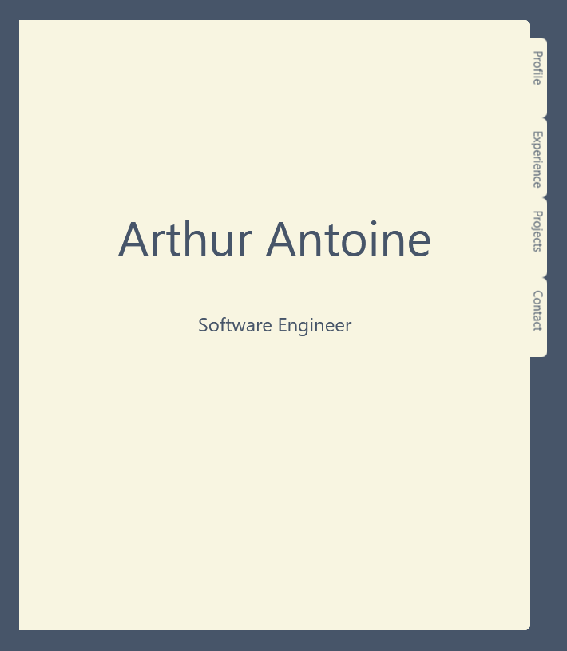

<a name="readme-top"></a>

<!-- PROJECT LOGO -->
<br />
<div align="center">

  <h3 align="center">Arthur Antoine's Portfolio</h3>

  <p align="center">
    <br />
    <a href="arthurfantoine.com">Live Site</a>
    ·
    <a href="https://github.com/aantoin/arthurfantoine.com/issues">Report Bug</a>
    ·
    <a href="https://github.com/aantoin/arthurfantoine.com/issues">Request Feature</a>
  </p>
</div>

<!-- TABLE OF CONTENTS -->
<details>
  <summary>Table of Contents</summary>
  <ol>
    <li>
      <a href="#about-the-project">About The Project</a>
      <ul>
        <li><a href="#built-with">Built With</a></li>
      </ul>
    </li>
    <li>
      <a href="#getting-started">Getting Started</a>
      <ul>
        <li><a href="#prerequisites">Prerequisites</a></li>
        <li><a href="#installation">Installation</a></li>
      </ul>
    </li>
  </ol>
</details>

<!-- ABOUT THE PROJECT -->

## About The Project

<a href="https://arthurfantoine.com"></a>

This is a simple static site meant to provide an overview of my skills and route interested visitors to my projects.

<p align="right">(<a href="#readme-top">back to top</a>)</p>

### Built With

- [![Vue][Vue.js]][Vue-url]
- [![Tailwind][Tailwind CSS]][Tailwind-url]

<p align="right">(<a href="#readme-top">back to top</a>)</p>

<!-- GETTING STARTED -->

## Getting Started

You could just visit the site at <a href="https://arthurfantoine.com">arthurfantoine.com</a>, but if you'd like to run the project locally just follow the instructions below.

### Prerequisites

- npm
  ```sh
  npm install npm@latest -g
  ```

### Installation

1. Clone the repo
   ```sh
   git clone https://github.com/aantoin/ArthurFAntoine.com.git
   ```
2. Install NPM packages
   ```sh
   npm install
   ```
3. Launch the development server
   ```sh
   npm run dev
   ```

<p align="right">(<a href="#readme-top">back to top</a>)</p>

<!-- MARKDOWN LINKS & IMAGES -->
<!-- https://www.markdownguide.org/basic-syntax/#reference-style-links -->

[site-screenshot]: docs/screenshot.png

<!-- Tech Links -->

[Vue.js]: https://img.shields.io/badge/Vue.js-35495E?style=for-the-badge&logo=vuedotjs&logoColor=4FC08D
[Vue-url]: https://vuejs.org/
[Tailwind CSS]: https://img.shields.io/badge/Tailwind_CSS-35495E?style=for-the-badge&logo=tailwindcss&logoColor=06B6D4
[Tailwind-url]: https://tailwindcss.com/
